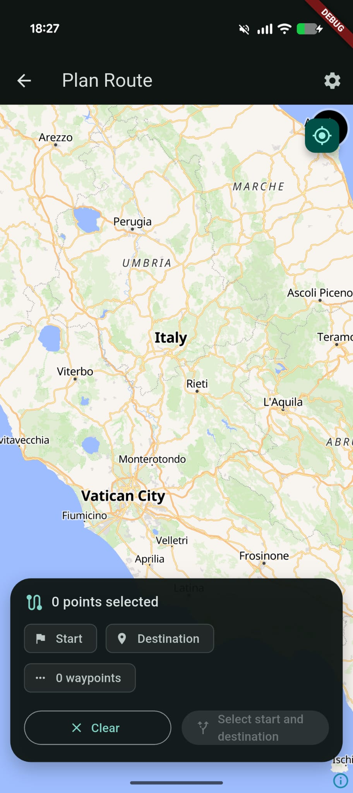
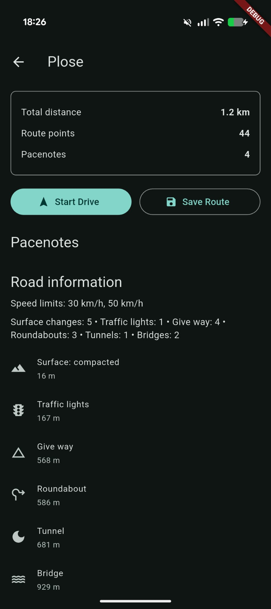
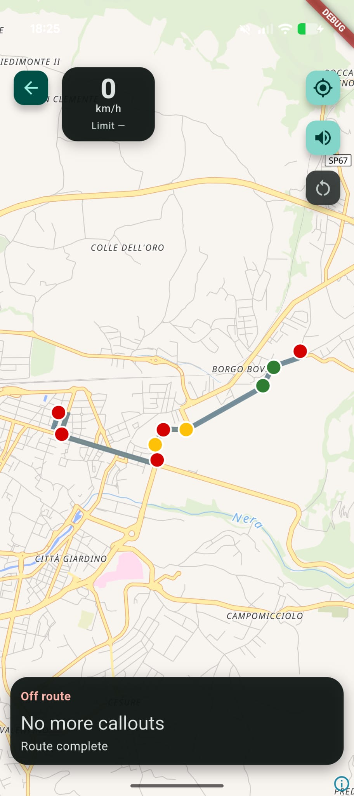
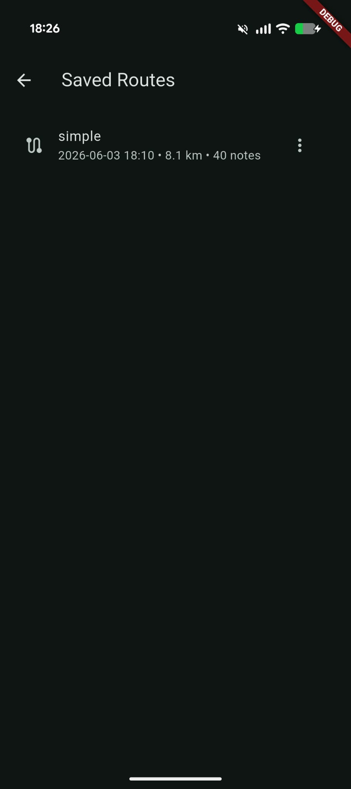

<div align="center">
  

  # RalRoads

  **A pocket co-driver for smarter road trips.**
</div>

RalRoads is an Android-first Flutter app for planning road routes, generating rally-style pacenotes, and using spoken callouts while driving. It combines online route geometry, local route analysis, live GPS matching, and best-effort OpenStreetMap road metadata to give you a compact co-driver experience on your phone.

The app is built for enthusiasts who want more context than a simple blue line: route danger zones, upcoming callouts, current speed, speed limits, road features, and saved routes are all available locally once a route has been planned.

## Screenshots

| Route planner | Route preview | Drive mode | Saved routes |
| --- | --- | --- | --- |
|  |  |  |  |

## Features

- Interactive route planning with start, destination, and waypoint selection
- Live MapLibre navigation map using OpenFreeMap styling
- Current GPS position with a driving marker and follow mode
- Rally-style pacenotes and spoken TTS callouts
- Color-coded route danger zones for tighter or more important callouts
- Current speed and current speed limit display
- OpenStreetMap/Overpass road warnings and road metadata
- Speed bumps, traffic lights, stop/give-way signs, surface changes, tunnels, bridges, and roundabouts
- Optional speed camera warnings, disabled by default
- Saved routes with local storage
- Route renaming without losing geometry, pacenotes, warnings, or speed-limit data
- OpenRouteService API key entry and testing from app settings
- Optional developer API key via Dart defines

## How It Works

1. Pick a start, destination, and any waypoints on the map.
2. RalRoads requests route geometry from OpenRouteService.
3. The client analyzes the route locally to generate pacenotes from geometry.
4. The app enriches the route with OpenStreetMap metadata from Overpass.
5. During driving, GPS route matching triggers upcoming callouts and warnings.

Generated callouts are stored with saved routes, along with road warnings and speed-limit segments, so renamed or reopened routes keep their driving context.

## Setup

RalRoads is a Flutter project. Install Flutter, then run:

```sh
flutter pub get
flutter run
```

Online route planning requires an OpenRouteService API key. The app can launch without a key, and map display still works, but route planning is disabled until a key is available.

Add your key inside the app:

1. Open **Settings**.
2. Paste your OpenRouteService API key.
3. Save and optionally test the key.

For development builds, you can also provide a fallback key:

```sh
flutter run --dart-define=ORS_API_KEY=your_key_here
```

Keys saved in Settings take priority over the development key.

## OpenRouteService API Key

Create a free OpenRouteService key here:

https://openrouteservice.org/sign-up/

RalRoads uses OpenRouteService for online route planning. If the key is missing, invalid, rate-limited, or the service is unavailable, the app shows a user-facing error instead of treating that as a route result.

## Map And Road Data

RalRoads uses MapLibre with OpenFreeMap/OpenStreetMap-based map display. Road warnings and metadata are loaded from OpenStreetMap through Overpass on a best-effort basis.

OpenStreetMap data can be incomplete, outdated, or inconsistent by region. Speed limits, traffic lights, surface tags, tunnels, bridges, roundabouts, and other road features should be treated as helpful context, not guaranteed truth.

## Safety And Legal Note

RalRoads is an assistance tool. Always follow traffic laws, road signs, current conditions, and your own judgment.

Speed camera warnings may be restricted or illegal in some countries. They are disabled by default; enable them only where legal.

Pacenotes are generated from route geometry and available road context. They are not a substitute for official navigation, traffic-law awareness, or safe driving.

## Tech Stack

| Area | Technology |
| --- | --- |
| App framework | Flutter / Dart |
| Maps | MapLibre GL |
| Map style/data | OpenFreeMap / OpenStreetMap |
| Routing | OpenRouteService |
| Road metadata | Overpass / OpenStreetMap |
| Local storage | Hive |
| GPS | Geolocator |
| Voice | Flutter TTS |

## Current Limitations

- OpenStreetMap and Overpass metadata may be incomplete or outdated.
- Online route planning depends on OpenRouteService availability and a valid API key.
- Pacenote generation is best-effort and based on route geometry plus available context.
- There is no backend account system or cloud sync.
- Offline regional maps are not included yet.
- RalRoads is not a replacement for official navigation, legal awareness, or traffic-condition monitoring.

## Roadmap Ideas

- Offline route import
- GPX import/export
- Better roundabout and junction intelligence
- Offline regional maps
- More polished route editing
- Better voice profiles
- Route sharing and backup options

## Development Commands

```sh
flutter pub get
flutter analyze
flutter build apk --debug
flutter run
```

For launcher icon generation after changing the app logo:

```sh
dart run flutter_launcher_icons
```
