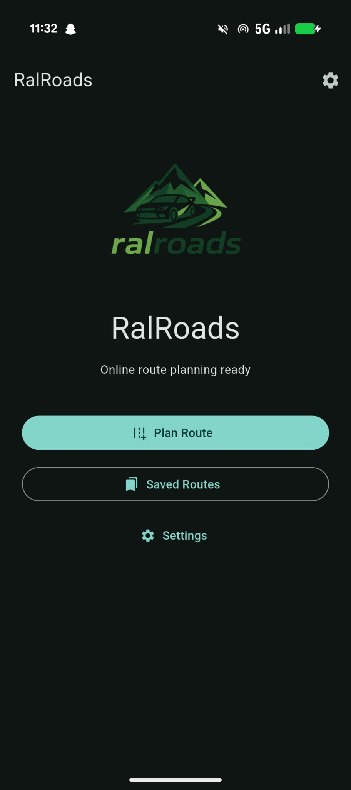
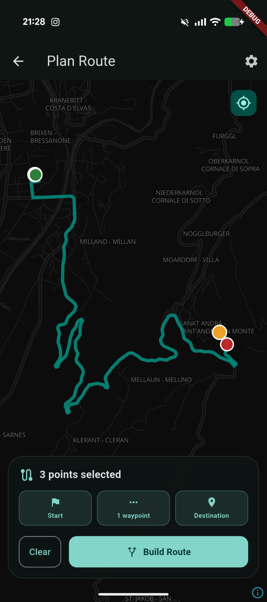
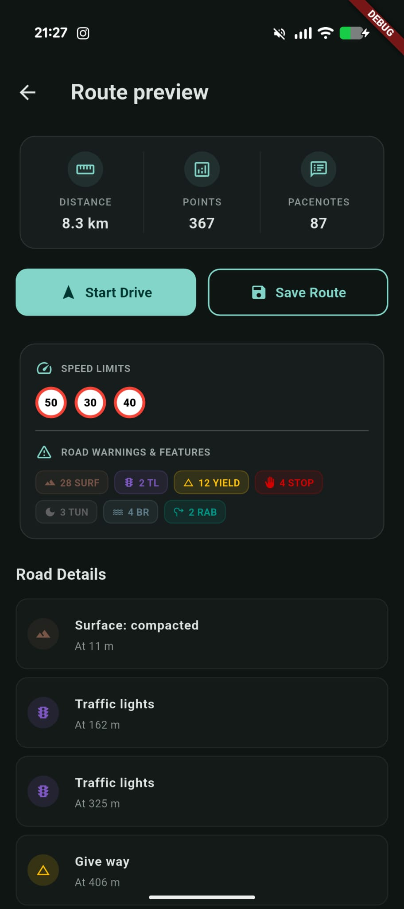
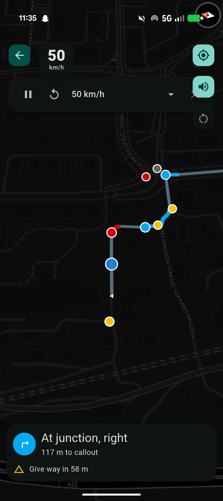
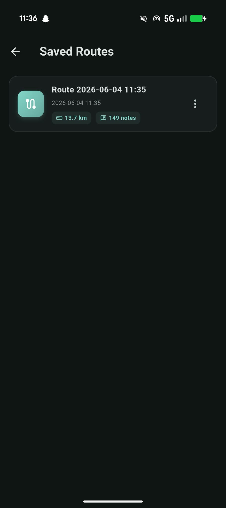
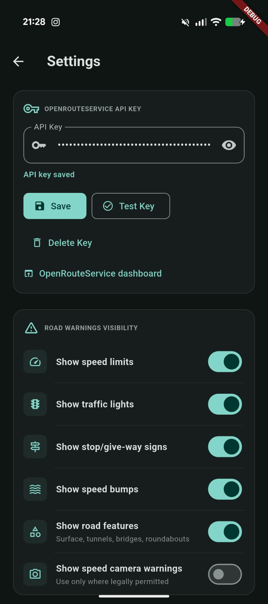
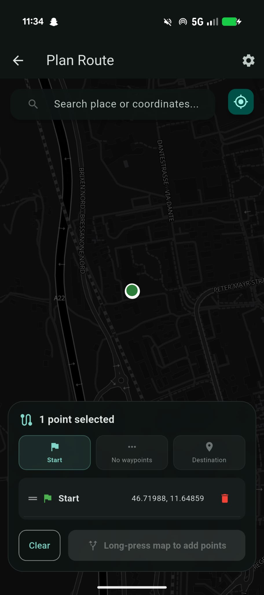
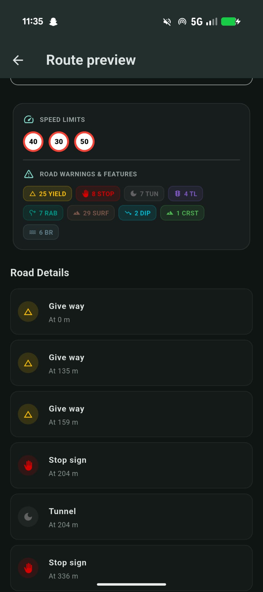

<div align="center">
  

  # RalRoads

  **A pocket co-driver for smarter road trips.**
</div>

RalRoads is an Android-first Flutter app for planning road routes, generating rally-style pacenotes, and using spoken callouts while driving. It combines online route geometry, local route analysis, live GPS matching, and best-effort OpenStreetMap road metadata to give you a compact co-driver experience on your phone.

The app is built for enthusiasts who want more context than a simple blue line: route danger zones, upcoming callouts, current speed, speed limits, road features, and saved routes are all available locally once a route has been planned.

## Screenshots

| Home Screen | Route Planner | Route Preview & Map |
| --- | --- | --- |
|  |  |  |

| Drive Mode | Saved Routes | Settings |
| --- | --- | --- |
|  |  |  |

| Start at My Location | Reverse Route | Pacenote Detail Settings |
| --- | --- | --- |
|  |  |  |

| Roadbook Editor | Preview Map Pacenotes |
| --- | --- |
|  |  |

### Screen Descriptions

*   **Home Screen**: A clean starting hub that displays your list of saved routes, direct settings access, and an intuitive entry point to begin planning a new route.
*   **Route Planner**: Features a full-screen interactive map to set start, waypoint, and destination markers by tapping. It shows live status counts in a premium glassmorphic bottom panel and builds the route instantly. Now supports one-tap **Start at My Location** using your device GPS coordinate, and one-tap **Reverse Route** to invert your route coordinates.
*   **Route Preview**: Offers a comprehensive summary of the computed trip (distance, time, average speed) alongside an interactive **Route Map Preview** showing the route path and color-coded pacenote markers. Selecting any pacenote dynamically zooms, centers, and highlights it.
*   **Roadbook Editor**: Accessible from the Route Preview screen by tapping any pacenote. Features a bottom sheet modal to customize pacenote type/direction, severity (1-6), modifiers (Short, Long, Opens, Tightens), and custom spoken callout texts. Edits are persistently saved to Hive storage.
*   **Drive Mode (HUD)**: A high-fidelity, real-time navigation display featuring a dynamic high-contrast vehicle chevron matching heading direction, live speed and European speed limit sign indicators, upcoming co-driver voice notes, real-time warning cards (bumps, traffic lights, tunnels), and a toggleable auto-follow button.
*   **Saved Routes**: Displays previously recorded routes in styled cards with colored icon gradients and quick metric badges (distance and notes), allowing fast loading or deletion.
*   **Settings**: A organized settings panel with grouped cards to configure and validate OpenRouteService API keys, select which road warnings are active, and toggle map features like heading-up map rotation and the new high-contrast black map style. Features a new **Pacenote Detail Level** setting card (Calm, Balanced, Rally).

## Features

- Interactive route planning with start, destination, and waypoint selection
- **Start at My Location**: Auto-populate the first waypoint using live device GPS coordinates
- **Reverse Route**: Invert the coordinate list of your planned route with a single tap
- Live MapLibre navigation map using OpenFreeMap styling
- Smooth, responsive GPS position tracking with coordinate interpolation, movement fallback speed estimation, and outlier jump filtering
- "GPS Weak" notification badge displayed automatically when accuracy degrades
- Keeps the screen awake during active navigation using a lifecycle-aware wakelock
- **Pacenote Detail Settings**: Dynamic threshold tuning based on driving style preferences:
  - **Calm**: Filters minor bends, higher curve radius detection threshold (140m).
  - **Balanced**: Standard detailed logging, default curve radius detection threshold (180m).
  - **Rally**: Maximum precision warnings, very sensitive curve radius detection threshold (220m).
- **Interactive Roadbook Editor**: Manually override generated pacenotes' direction, severity, modifiers, and custom warning descriptions
- **Map Highlights**: Live centering, zooming, and highlighting of edited or selected pacenotes on the preview map
- Continuous rally-style pacenote generation with geometry densification (curves, straights, opens/tightens) and recommended advisory speeds
- Intelligent TTS callout grouping using "into" linking to prevent overlapping and improve pacing
- Color-coded route danger zones for tighter or more important callouts
- Current speed and current speed limit display
- OpenStreetMap/Overpass road warnings and road metadata
- Speed bumps, traffic lights, stop/give-way signs, surface changes, tunnels, bridges, and roundabouts with conservative geometry detection
- Optional speed camera warnings, disabled by default
- Saved routes with local storage
- Route renaming without losing geometry, pacenotes, warnings, or speed-limit data
- OpenRouteService API key entry and testing from app settings
- Optional developer API key via Dart defines

## How It Works

1. Pick a start, destination, and any waypoints on the map (or use GPS position / reverse route).
2. RalRoads requests route geometry from OpenRouteService.
3. The client analyzes the route locally to generate pacenotes from geometry.
4. The app enriches the route with OpenStreetMap metadata from Overpass.
5. Review, edit, and highlight pacenotes using the Map Preview and Roadbook Editor.
6. During driving, GPS route matching triggers upcoming callouts and warnings.

Generated callouts are stored with saved routes, along with road warnings and speed-limit segments, so renamed or reopened routes keep their driving context.

## Setup

RalRoads is a Flutter project. Install Flutter, then run:

```sh
flutter pub get
flutter run
```

Online route planning requires an OpenRouteService API key. The app can launch without a key, and map display still works, but route planning is disabled until a key is available.

Add your key inside the app:

1. Open **Settings**.
2. Paste your OpenRouteService API key.
3. Save and optionally test the key.

For development builds, you can also provide a fallback key:

```sh
flutter run --dart-define=ORS_API_KEY=your_key_here
```

Keys saved in Settings take priority over the development key.

## OpenRouteService API Key

Create a free OpenRouteService key here:

https://openrouteservice.org/sign-up/

RalRoads uses OpenRouteService for online route planning. If the key is missing, invalid, rate-limited, or the service is unavailable, the app shows a user-facing error instead of treating that as a route result.

## Map And Road Data

RalRoads uses MapLibre with OpenFreeMap/OpenStreetMap-based map display. Road warnings and metadata are loaded from OpenStreetMap through Overpass on a best-effort basis.

OpenStreetMap data can be incomplete, outdated, or inconsistent by region. Speed limits, traffic lights, surface tags, tunnels, bridges, roundabouts, and other road features should be treated as helpful context, not guaranteed truth.

## Safety And Legal Note

RalRoads is an assistance tool. Always follow traffic laws, road signs, current conditions, and your own judgment.

Speed camera warnings may be restricted or illegal in some countries. They are disabled by default; enable them only where legal.

Pacenotes are generated from route geometry and available road context. They are not a substitute for official navigation, traffic-law awareness, or safe driving.

## Tech Stack

| Area | Technology |
| --- | --- |
| App framework | Flutter / Dart |
| Maps | MapLibre GL |
| Map style/data | OpenFreeMap / OpenStreetMap |
| Routing | OpenRouteService |
| Road metadata | Overpass / OpenStreetMap |
| Local storage | Hive |
| GPS | Geolocator |
| Voice | Flutter TTS |

## Current Limitations

- OpenStreetMap and Overpass metadata may be incomplete or outdated.
- Online route planning depends on OpenRouteService availability and a valid API key.
- Pacenote generation is best-effort and based on route geometry plus available context.
- There is no backend account system or cloud sync.
- Offline regional maps are not included yet.
- RalRoads is not a replacement for official navigation, legal awareness, or traffic-condition monitoring.

## Roadmap Ideas

- Offline route import
- GPX import/export
- Better roundabout and junction intelligence
- Offline regional maps
- Better voice profiles
- Route sharing and backup options

## Development Commands

```sh
flutter pub get
flutter analyze
flutter build apk --debug
flutter run
```

For launcher icon generation after changing the app logo:

```sh
dart run flutter_launcher_icons
```
