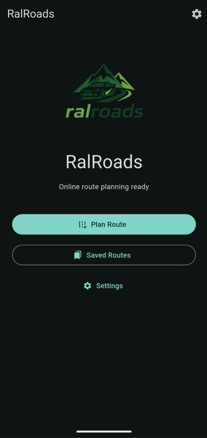
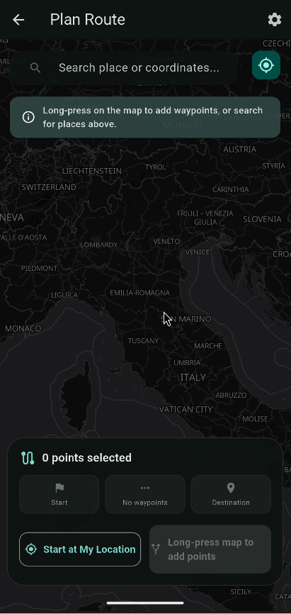
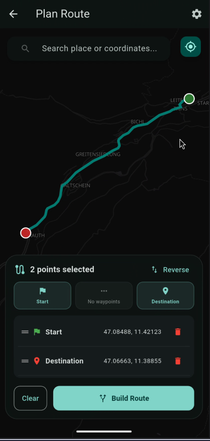
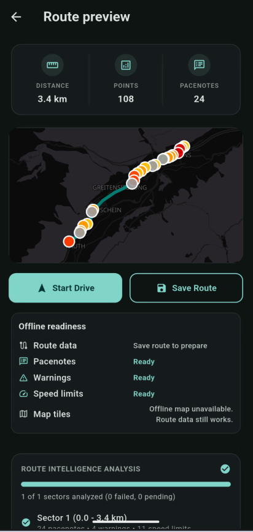
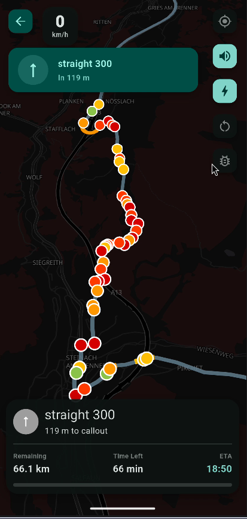
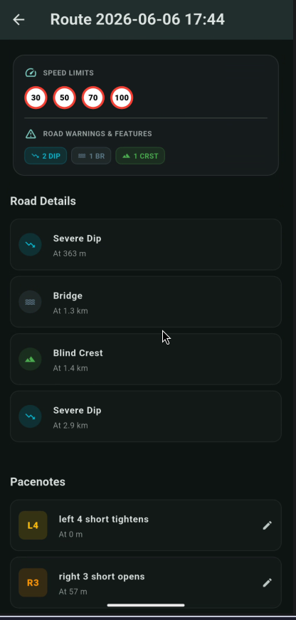
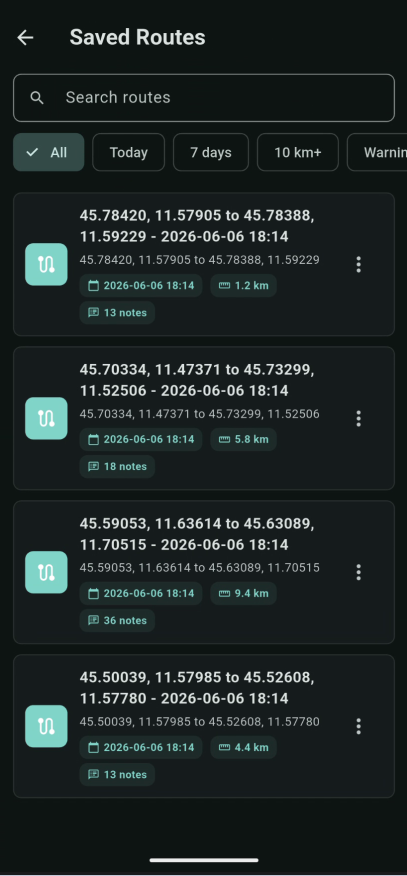
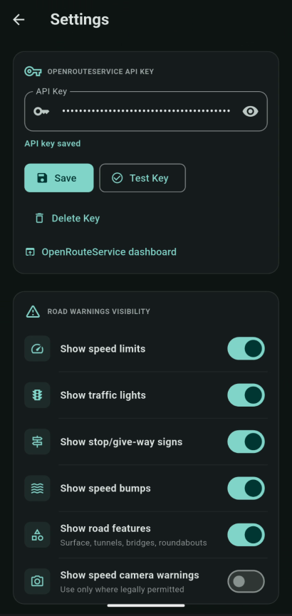
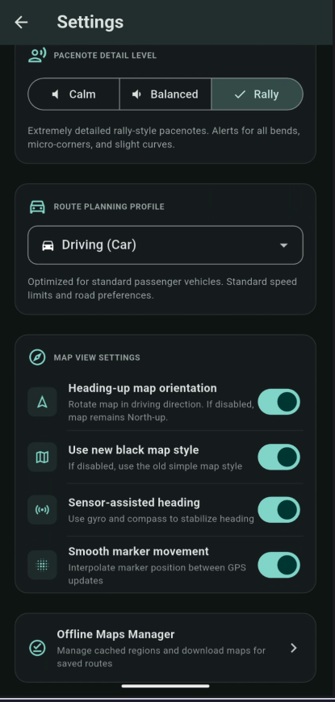

<div align="center">
  

  # RalRoads

  **A pocket co-driver for planning roads, reading the route, and timing the next callout.**

  Android-first Flutter app for route planning, rally-style pacenotes, spoken driving callouts, road warnings, saved routes, and offline-ready route review.
</div>

## Why RalRoads

RalRoads is built for drivers who want more than a blue navigation line. Plan a route, let the app analyze its geometry, review the generated roadbook, then drive with a dark map HUD that shows the next pacenote, current speed, speed-limit context, route progress, warnings, and ETA.

It combines OpenRouteService route geometry, MapLibre maps, local pacenote generation, GPS route matching, and best-effort OpenStreetMap road metadata from Overpass. The result is a compact co-driver experience that stays focused on what is coming up next.

## Screenshots

| Home | Plan A Route | Build A Route |
| --- | --- | --- |
|  |  |  |

| Preview | Drive HUD | Roadbook |
| --- | --- | --- |
|  |  |  |

| Saved Routes | API & Warnings | Driving Settings |
| --- | --- | --- |
|  |  |  |

## Highlights

- **Route planning on a real map**: search places or coordinates, use your current location, long-press points, add waypoints, reverse the route, and build with OpenRouteService.
- **Generated pacenotes**: local route analysis creates straights, corners, opens/tightens, junctions, roundabouts, road warnings, advisory speeds, and color-coded route markers.
- **Drive mode HUD**: live map, upcoming callout banner, current speed, speed-limit sign, voice toggle, warning controls, remaining distance, time left, ETA, and progress.
- **Roadbook review**: inspect speed limits, road features, warnings, and pacenotes before driving.
- **Spoken callouts**: timed TTS callouts with grouping, priority, and conservative handling for road features like junctions and roundabouts.
- **Saved routes**: local Hive storage for route geometry, pacenotes, warnings, speed limits, and analysis chunks, with searchable/filterable saved-route cards.
- **Offline readiness**: saved route data stays available locally, and the app can manage downloaded map regions when supported by the platform.
- **Configurable driving style**: Calm, Balanced, and Rally pacenote detail levels plus route profile and map-behavior settings.

## How It Works

1. Choose a start, destination, and optional waypoints.
2. RalRoads requests route geometry from OpenRouteService.
3. The app analyzes the route locally to generate pacenotes from geometry.
4. Overpass/OpenStreetMap metadata adds road context such as traffic lights, speed bumps, surfaces, bridges, tunnels, speed limits, and roundabouts.
5. You preview the route, inspect the roadbook, save it if you want, and start driving.
6. During driving, GPS route matching schedules upcoming callouts and warnings at useful lead distances.

## Setup

RalRoads is a Flutter project.

```sh
flutter pub get
flutter run
```

Online route planning requires an OpenRouteService API key. The app can launch without a key, but route planning needs one.

Add a key in the app:

1. Open **Settings**.
2. Paste your OpenRouteService API key.
3. Tap **Save**.
4. Optionally tap **Test Key**.

For development builds, you can also provide a fallback key:

```sh
flutter run --dart-define=ORS_API_KEY=your_key_here
```

Keys saved in Settings take priority over the development key.

## Data Sources

| Purpose | Source |
| --- | --- |
| App framework | Flutter / Dart |
| Maps | MapLibre GL |
| Map style/data | OpenFreeMap / OpenStreetMap |
| Routing | OpenRouteService |
| Place search | OpenRouteService geocoding, with Photon fallback |
| Road metadata | Overpass / OpenStreetMap |
| Local storage | Hive |
| GPS | Geolocator, compass, sensors |
| Voice | Flutter TTS |

## Development

Common commands:

```sh
flutter pub get
flutter analyze
flutter test
flutter run
```

Generate launcher icons after changing the app logo:

```sh
dart run flutter_launcher_icons
```

## Current Limits

- Route planning and online place search depend on external services and an internet connection.
- OpenStreetMap and Overpass metadata can be incomplete, outdated, duplicated, or locally inconsistent.
- Pacenotes are generated from geometry and available context, so they are best-effort.
- There is no account system, backend sync, or cloud backup.
- Platform offline-map support may vary.

## Safety

RalRoads is an assistance tool, not an official navigation authority. Always follow road signs, traffic laws, local restrictions, current conditions, and your own judgment.

Speed camera warnings may be restricted or illegal in some places. They are disabled by default; enable them only where legal.

