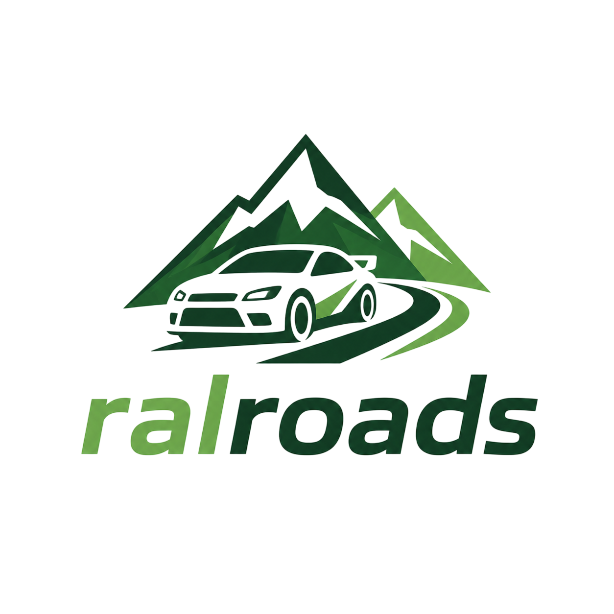
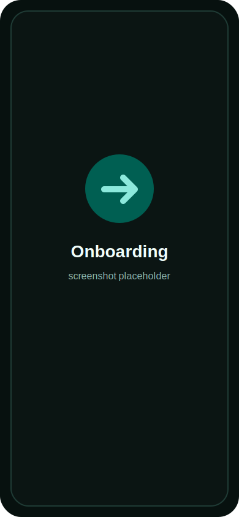
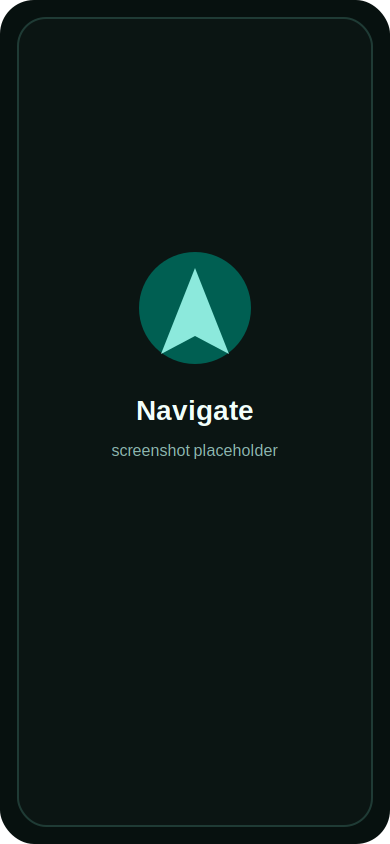
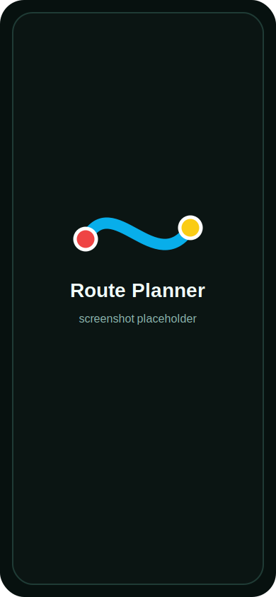
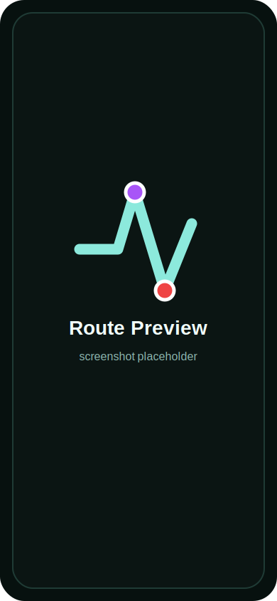
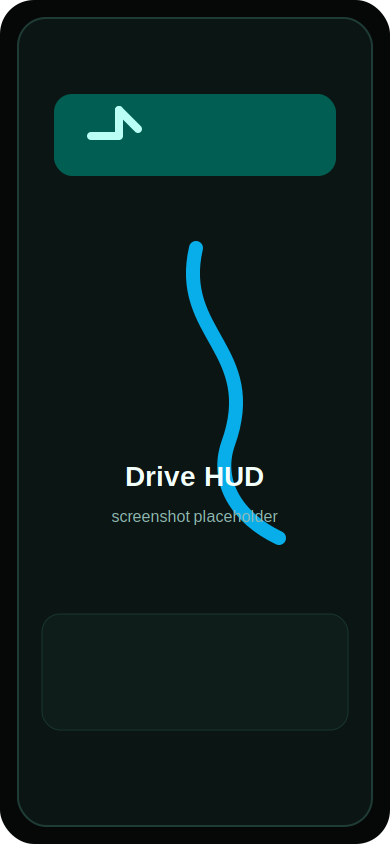
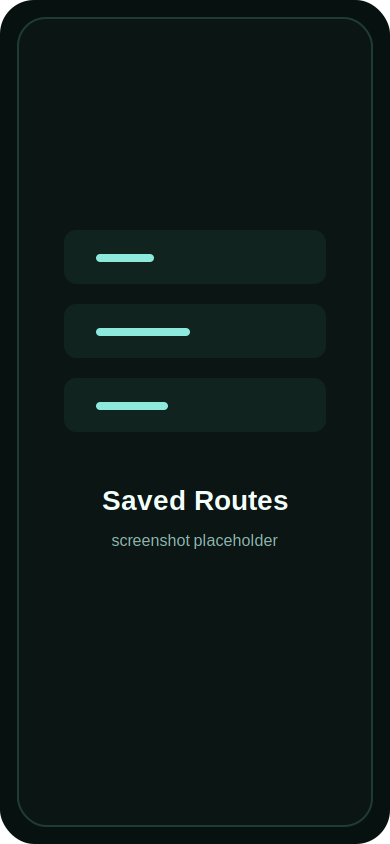
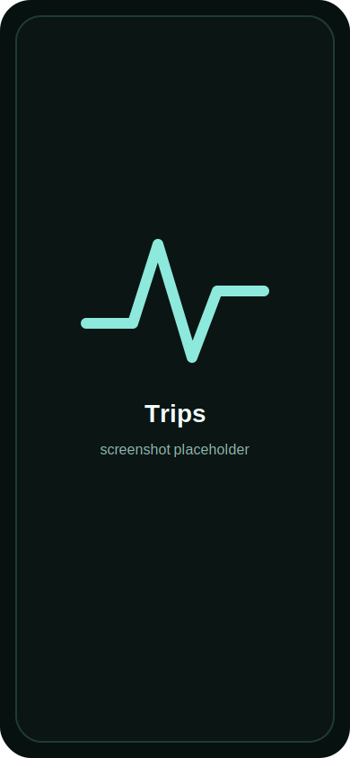
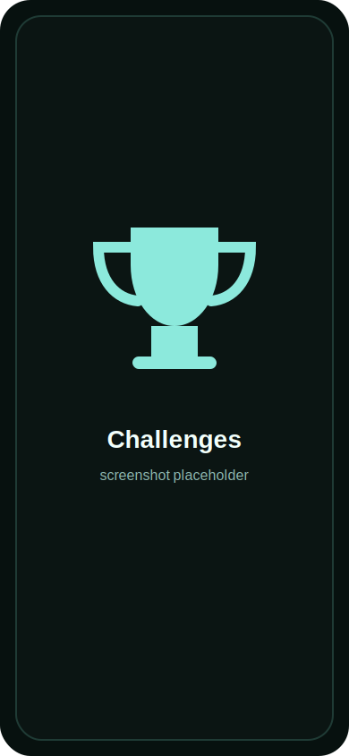
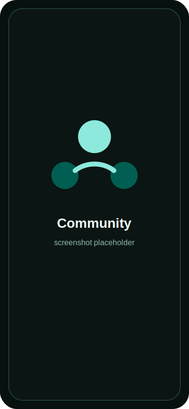

<div align="center">
  

  # RalRoads

  **Plan the road. Hear the next corner. Keep the drive.**

  RalRoads is a Flutter navigation companion for drivers who want more than a blue line. It turns routes into readable pacenotes, speaks callouts at driving speed, records trips, and lets clean segments become local or Matrix-powered challenges.
</div>

<br>

| Plan | Drive | Compete |
| --- | --- | --- |
| Build road-aware routes with waypoints, warnings, speed context, and generated pacenotes. | Follow a dark live HUD with timed voice callouts, route progress, rerouting, and trip capture. | Save segments, validate attempts, and sync social challenges through an optional Matrix account. |

## Screens

| Onboarding | Navigate | Route Planner |
| --- | --- | --- |
|  |  |  |

| Route Preview | Drive HUD | Saved Routes |
| --- | --- | --- |
|  |  |  |

| Trips | Challenges | Community |
| --- | --- | --- |
|  |  |  |

Screenshot placeholders live in `images/screens/`. Replace those files with current captures when the app screens are ready.

## Why It Exists

Most navigation apps tell you where to go. RalRoads is built around what a driver needs to know next.

Before a drive, it gives you a route you can inspect: corners, junctions, roundabouts, warnings, speed-limit context, and road metadata where available. During a drive, it behaves more like a calm co-driver: the next callout is visible, the voice cue is timed by speed and distance, and the HUD stays focused on the road ahead.

Afterward, the drive is not lost. Trips can become summaries, exports, private segments, validated attempts, or shared challenges.

## Core Experience

### Route Planning

- Search places, choose a start and destination, add waypoints, and preview the result on a MapLibre map.
- Generate pacenotes from route geometry: straights, corners, opens, tightens, junctions, roundabouts, and exits.
- Add road context from OpenStreetMap and Overpass, including warnings, traffic lights, surfaces, speed bumps, tunnels, bridges, and speed limits when available.
- Save only the routes the user explicitly wants to keep, with names based on start, destination, and creation date.

### Live Driving

- Dark driving HUD with the next callout, current speed, speed-limit sign, remaining distance, ETA, and route progress.
- Spoken callouts scheduled by distance and speed so instructions arrive before the decision point.
- Voice, warning, follow-camera, and debug controls designed for quick in-drive use.
- Rerouting and optional trip recording during navigation.

### Trips, Segments, And Challenges

- Record local trips privately by default.
- Review trip summaries with distance, time, quality, points, and export/share actions.
- Crop clean drives into reusable private segments.
- Validate challenge attempts with GPS quality and rule checks.
- Create active or past rally-style challenges from saved segments.

### Matrix Community

- Connect a Matrix account when social sync is useful, or keep the app local-only.
- Manage profile, friends, groups, notifications, blocks, and directory events.
- Share segments and challenge activity through Matrix-backed sync.

## App Map

| Area | What the user gets |
| --- | --- |
| **Onboarding** | ORS setup, profile creation, optional Matrix connection, and first-run readiness. |
| **Navigate** | New route planning, recent saved routes, offline maps, and navigation settings. |
| **Route Preview** | A final roadbook-style review before driving. |
| **Drive HUD** | Live navigation, callouts, warnings, route progress, and trip capture. |
| **Saved Routes** | Searchable and filterable local route library. |
| **Trips** | Recorded drives, summaries, exports, and segment creation entry points. |
| **Segments** | Reusable roads for attempts and challenges. |
| **Challenges** | Local or synced rally-style competitions. |
| **Community** | Matrix identity, friends, groups, notifications, and sharing. |
| **Settings** | ORS, Matrix, voice, warnings, map behavior, route profile, and recording preferences. |

## How RalRoads Builds A Drive

1. The user chooses a route.
2. OpenRouteService returns route geometry.
3. Local analysis converts that geometry into pacenotes and callout anchors.
4. OpenStreetMap and Overpass add road metadata where it can be found.
5. The route preview shows the roadbook before the drive starts.
6. GPS route matching tracks progress and schedules the next callout.
7. Finished drives can become history, exports, segments, attempts, or challenges.

## Tech Stack

| Layer | Tools |
| --- | --- |
| App | Flutter, Dart, Material 3 |
| Maps | MapLibre GL, OpenFreeMap, OpenStreetMap |
| Routing and search | OpenRouteService |
| Road metadata | Overpass, OpenStreetMap |
| Local data | Drift, SQLite, Hive |
| Credentials | Flutter Secure Storage |
| Location and sensors | Geolocator, sensors, compass |
| Voice | Flutter TTS |
| Sharing | Share Plus |
| Social sync | Matrix |

## Getting Started

```sh
flutter pub get
flutter run
```

Online route planning requires an OpenRouteService API key. Add one inside **Settings**, or pass one during development:

```sh
flutter run --dart-define=ORS_API_KEY=your_key_here
```

Saved Settings keys take priority over development keys.

## Development Commands

```sh
flutter analyze
flutter test
```

Regenerate Drift code after database schema changes:

```sh
dart run build_runner build
```

Regenerate launcher icons after changing the logo:

```sh
dart run flutter_launcher_icons
```

## Screenshot Slots

The README uses stable placeholder files so screenshots can be refreshed without editing markdown.

| Placeholder | Screen |
| --- | --- |
| `images/screens/onboarding.svg` | First-run setup |
| `images/screens/navigate.svg` | Main navigation tab |
| `images/screens/map-planner.svg` | Route planner |
| `images/screens/route-preview.svg` | Route preview and roadbook |
| `images/screens/drive-hud.svg` | Live driving HUD |
| `images/screens/saved-routes.svg` | Saved routes |
| `images/screens/offline-maps.svg` | Offline maps |
| `images/screens/settings.svg` | Settings |
| `images/screens/matrix-connection.svg` | Matrix connection |
| `images/screens/trips.svg` | Trips dashboard |
| `images/screens/trip-recording.svg` | Trip recording |
| `images/screens/trip-summary.svg` | Trip summary |
| `images/screens/segment-creation.svg` | Segment creation |
| `images/screens/segment-detail.svg` | Segment detail |
| `images/screens/attempt-recording.svg` | Attempt recording |
| `images/screens/challenges.svg` | Challenges dashboard |
| `images/screens/challenge-detail.svg` | Challenge detail |
| `images/screens/community.svg` | Community dashboard |

## Limits

- Online planning, search, road metadata, and Matrix sync require network access.
- OpenStreetMap and Overpass metadata can be incomplete, duplicated, stale, or locally inconsistent.
- Pacenotes are generated from geometry and available context. They are helpful driving aids, not official road instructions.
- Offline map behavior depends on platform support and downloaded regions.
- Matrix features are optional and depend on the selected homeserver.

## Safety

RalRoads is an assistance tool. Always follow road signs, local traffic laws, current conditions, and your own judgment.

Speed camera or enforcement warnings may be restricted or illegal in some places. Enable them only where permitted.
